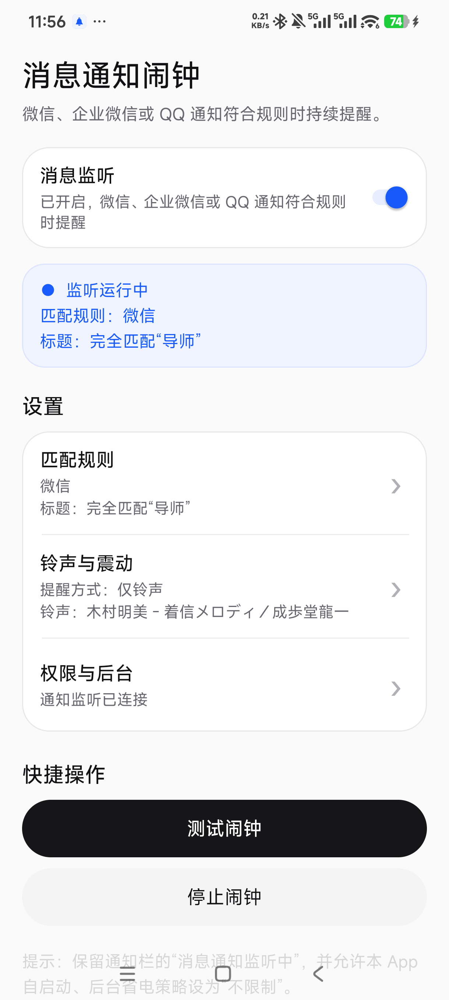
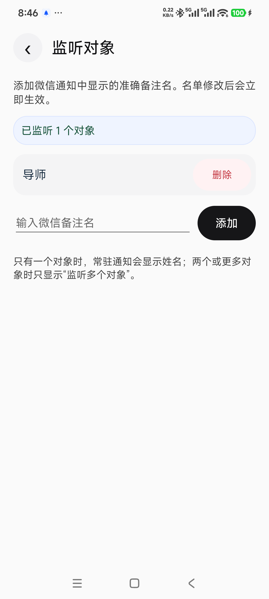
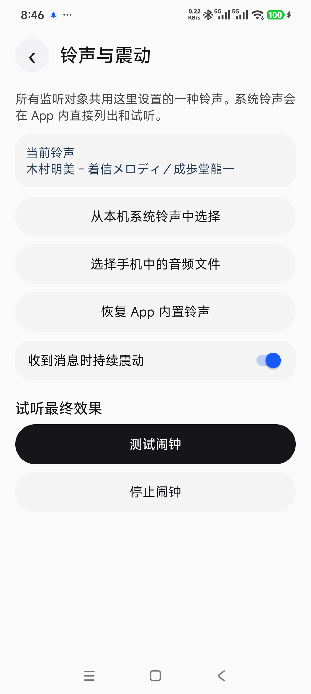
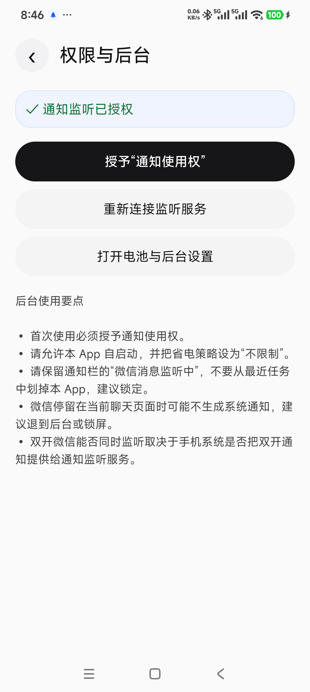

<div align="center">
  
  <h1>微信消息闹钟</h1>
  <p>当指定微信联系人发来消息时，让手机持续响铃和震动，直到你主动停止。</p>
</div>

## 项目简介

微信消息闹钟是一款完全运行在手机上的本地提醒工具，支持 Android 以及可安装 APK 的 HarmonyOS 设备。它通过系统提供的通知监听能力识别微信通知；当发送人的备注名与监听名单一致时，立即播放闹钟铃声，并可持续震动。

应用不依赖电脑，也不需要登录微信账号。它没有联网权限，通知内容和监听名单都只在本机处理。

## 下载安装

> **[点击直接下载手机安装包（v3.0.0）](https://github.com/fang520huang-lgtm/wechat_monitor/releases/download/v3.0.0/wechat-message-alarm-v3.0.0.apk)**

下载完成后，在手机中打开安装包并按系统提示完成安装。如果浏览器阻止安装，请在系统设置中临时允许当前浏览器安装未知来源应用。

## 界面预览

| 主页 | 监听对象 |
| --- | --- |
|  |  |

| 铃声与震动 | 权限与后台 |
| --- | --- |
|  |  |

## 主要功能

- 主页提供消息监听开关；关闭后停止监听并移除通知栏常驻状态，重新开启即可自动恢复。
- 可同时添加、删除多个监听对象，按微信通知中显示的备注名精确匹配。
- 只有一个监听对象时，常驻通知显示姓名；多个对象时只显示“监听多个对象”。
- 所有监听对象共用一种铃声，可选择系统铃声、手机中的音频文件或应用内置铃声。
- 可单独开启或关闭持续震动。
- 闹钟与震动会循环持续，直到点击闹钟通知、通知中的“停止闹钟”或应用内按钮。
- 常驻通知显示监听服务状态，便于确认应用仍在运行。
- 每分钟自动检查通知监听的真实连接状态；发现“已授权但未连接”时会自动解绑并重新连接。
- 监听开关开启时，支持系统启动及应用更新后自动恢复监听服务。
- 支持微信双开通知，但最终效果取决于手机系统是否向通知监听服务提供双开应用的通知。

## 使用方法

1. 安装并打开应用，在“权限与后台”中授予“通知使用权”。
2. 进入“监听对象”，添加微信通知里显示的准确备注名，例如“导师”。
3. 进入“铃声与震动”，选择铃声并设置是否持续震动。
4. 点击“测试闹钟”，确认铃声、震动和停止按钮工作正常。
5. 在系统设置中允许应用自启动，并将后台省电策略设为“不限制”。

建议将微信退到后台或锁屏后再测试。部分微信版本在停留于当前聊天页面时不会生成系统通知，这种情况下应用也无法收到该条通知。

## 隐私说明

- 应用未申请网络权限，不会上传通知、联系人或音频文件。
- 监听名单、铃声设置和震动设置保存在应用本地。
- 选择手机中的音频文件后，应用会将其复制到自身的私有目录中使用。
- 消息内容仅用于生成当次闹钟通知，不会被写入历史记录。

## 系统要求

- Android 8.0 或更高版本，或支持安装 APK 的 HarmonyOS 设备。
- 微信通知必须已开启，并允许在通知中显示发送人备注名。
- 不同品牌手机的自启动、后台运行和省电策略不同，请根据系统提示完成设置。

## 构建项目

准备环境：

- 第 17 版 Java 开发工具包。
- Android SDK 第 36 版。
- Android 调试桥接工具（仅在需要通过数据线安装时使用）。

在 Windows 中构建调试安装包：

```powershell
.\gradlew.bat assembleDebug
```

在 macOS 或 Linux 中构建：

```bash
./gradlew assembleDebug
```

生成的安装包位于：

```text
app/build/outputs/apk/debug/app-debug.apk
```

通过数据线安装：

```powershell
adb install -r app/build/outputs/apk/debug/app-debug.apk
```

## 版本规则

项目采用 `主版本.次版本.修订版本` 的版本号格式：

- 大规模功能或结构调整：提升主版本，例如 `2.x.x` → `3.0.0`。
- 新增独立功能且保持兼容：提升次版本，例如 `3.0.x` → `3.1.0`。
- 修复问题、调整文字或样式：提升修订版本，例如 `3.1.0` → `3.1.1`。
- 每次发布时，内部 `versionCode` 也必须递增。

## 实现方式

- 使用 Android 通知监听服务接收微信系统通知。
- 使用本地偏好设置保存监听名单和提醒选项。
- 使用系统媒体播放与震动接口持续提醒。
- 使用系统文档选择器导入手机中的音频文件。
- 使用前台常驻通知提高监听服务的可见性和存活稳定性。

## 项目结构

```text
app/src/main/
├── java/com/local/wechatalarm/   应用逻辑与页面
├── res/drawable-nodpi/           桌面和通知图标
├── res/mipmap-anydpi-v26/        自适应桌面图标
├── res/raw/                       内置铃声
└── AndroidManifest.xml           权限与应用组件声明
```

## 注意事项

- 本项目依赖微信生成的系统通知，无法读取未生成通知的消息。
- 备注名必须与通知标题完全一致。
- 手机厂商可能会限制后台服务，请保留“微信消息监听中”通知，并正确配置自启动和省电策略。
- 本项目与微信及腾讯公司无关，仅用于个人提醒和技术学习。使用时请遵守当地法律，并尊重他人隐私。

## 开源许可

本项目采用 [MIT 许可证](LICENSE)。

### 内置音频说明

当前内置铃声“木村明美 - 着信メロディ／成歩堂龍一”仅用于个人测试，不包含在本项目的 MIT 授权范围内。二次分发、公开发布或用于其他项目之前，请先替换为自行创作或已取得明确再分发授权的音频。
